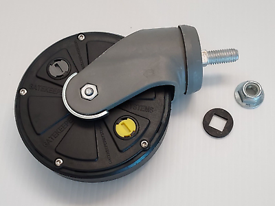
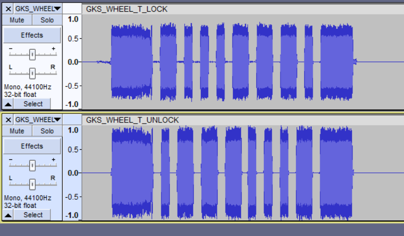
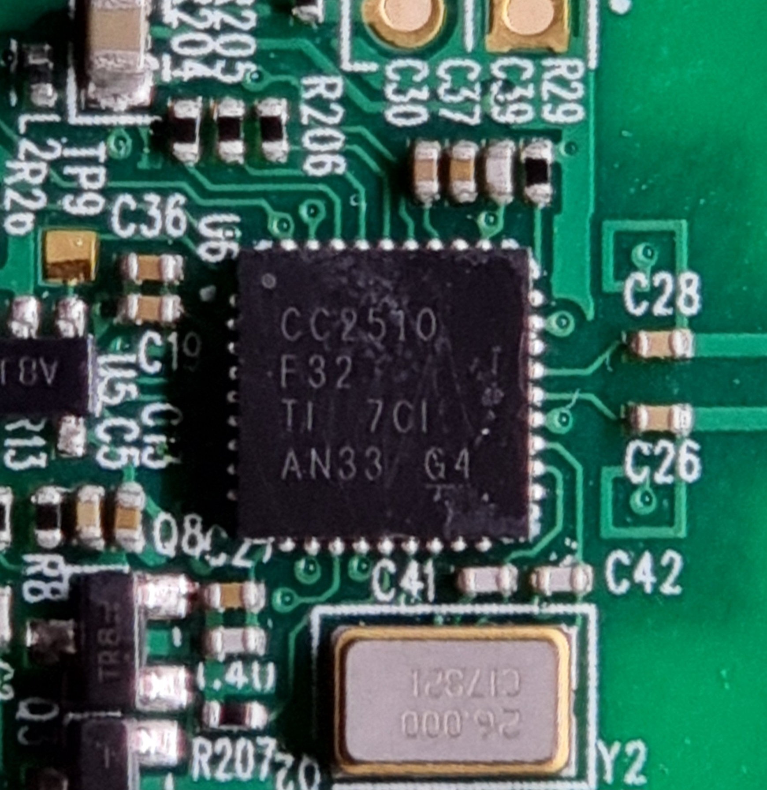
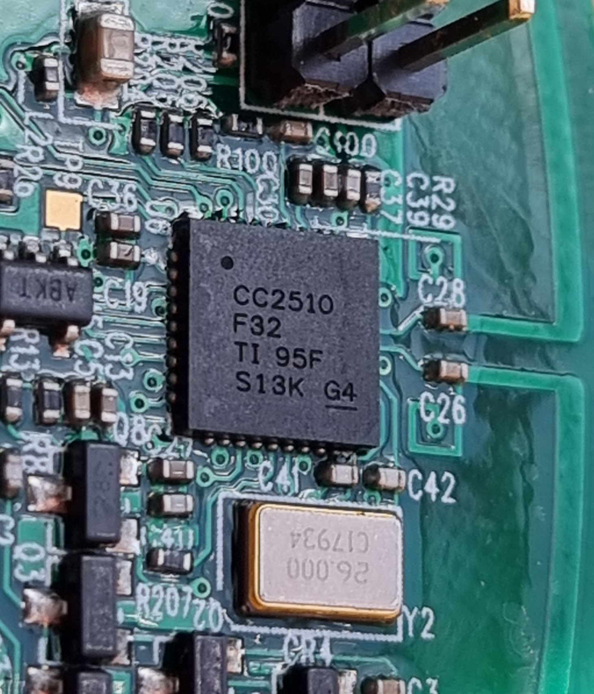
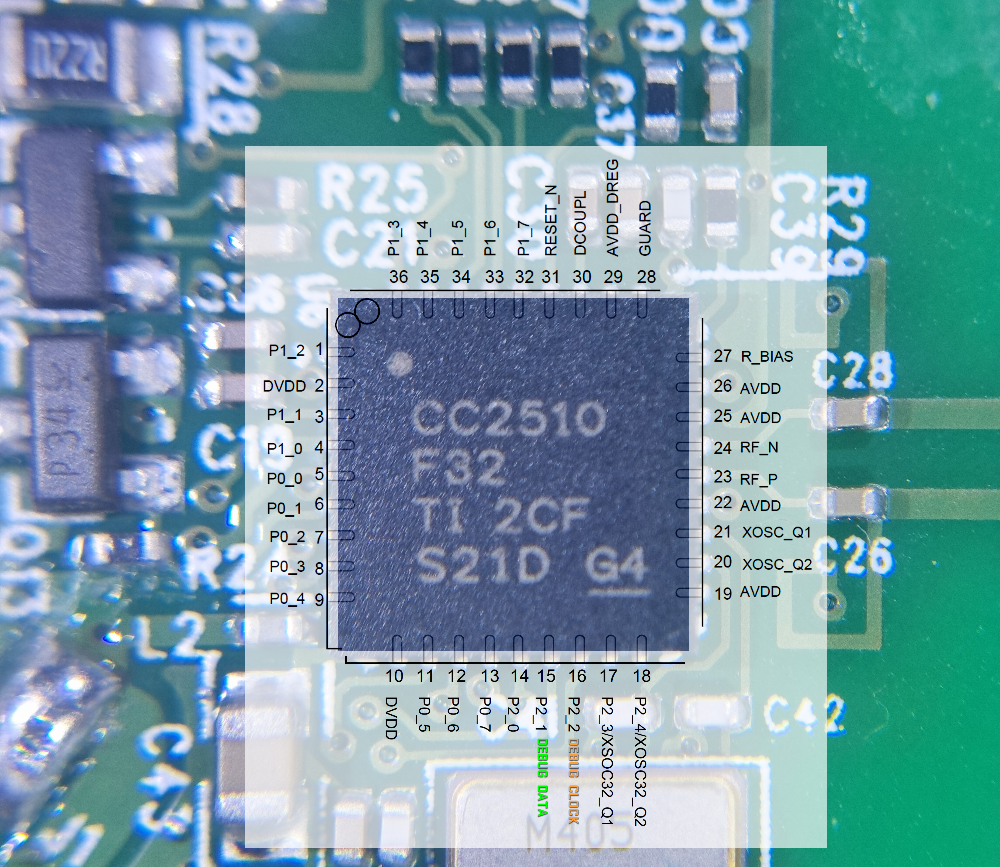

# GateKeeper Systems Smart Wheel Reversing

## About

This repository houses the results from an initial reverse engineering effort focused on the smart wheel used by various supermarkets.

### Unlocking and Locking Mechanism (8khz_unlock_lock)
This section showcases a practical example of Lock and Unlock signals that can be emitted through a speaker placed near the wheel. The signals were recorded with a custom-built Very Low Frequency (VLF) loop antenna. More details about loop antennas can be found [here](https://en.wikipedia.org/wiki/Loop_antenna).

The universally applied lock/unlock codes for GateKeeper's Smart Wheels are:

Lock Code: 10001110 (Hexadecimal: 0x8E)
Unlock Code: 01110001 (Hexadecimal: 0x71)

### chip-cc2510-F32

This contains memory dumps of the firmware from CC2510 chips.

Here is the pinout illustrated:

Each revision folder also contains a radio register dump html with values taken live from the chips.

RevN Unfortunately has a DEBUG_READ lock and possibly I will need to follow something [similar to this blog post](https://zeus.ugent.be/blog/22-23/reverse_engineering_epaper/) to get it's memory dumped out.

### Futhernotes

As it stands, the repository's contents are foundational. The goal moving forward is to uncover additional embedded functionalities within the firmware that extend beyond basic [replay attack](https://en.wikipedia.org/wiki/Replay_attack).

If you wish to help contribute or discuss anything feel free to get in touch.

## References

1. [Texas Instruments CC2510 Product Page](https://www.ti.com/product/CC2510)
2. [Denial of Shopping - Exploiting Shopping Cart Immobilization Systems, DEF CON 29 Presentation](https://infocon.org/cons/DEF%20CON/DEF%20CON%2029/DEF%20CON%2029%20presentations/Joseph%20Gabay%20-%20Dos-%20Denial%20of%20Shopping%20%E2%80%93%20Analyzing%20and%20Exploiting%20(Physical)%20Shopping%20Cart%20Immobilization%20Systems.pdf)
3. [Consumer B-Gone](https://www.tmplab.org/2008/06/18/consumer-b-gone/)
4. [How GateKeeper Systems Work (Archived)](https://web.archive.org/web/20170504023929/http://www.gatekeepersystems.com/sol_cc_cc_how_it_works.php)
